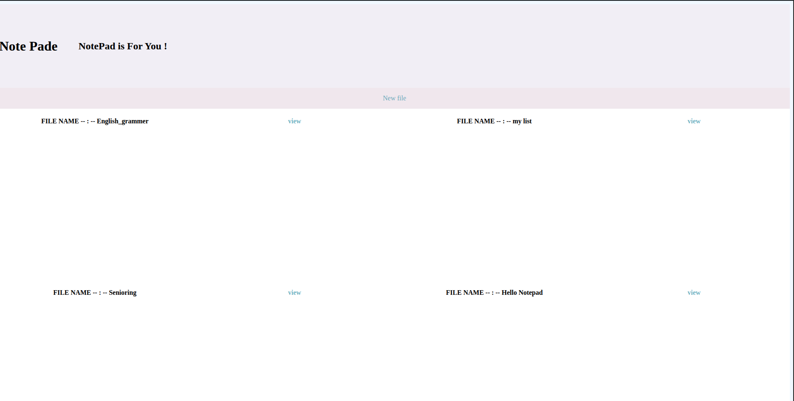

# Desktop Notepad 📝

A simple notepad application built with Django that lets you write notes and save them directly to your desktop.

## Features

- Create and edit text notes
- Save notes directly to the Desktop
- Simple and lightweight interface
- Built with Django and Python

## Screenshot

<p align="center">
  
</p>


## Getting Started

### Clone the repository

```bash
git clone https://github.com/mr-command/desktop-notepad.git
cd desktop-notepad
```

### Install dependencies

```bash
pip install django
```

### Run the server

```bash
python manage.py runserver
```

Open your browser and visit:

```
http://127.0.0.1:8000/
```


## Disclaimer

This project saves notes directly to the current user's Desktop. Depending on the operating system and permissions, the save location may need to be adjusted.

## Technologies

- Python
- Django
- HTML
- CSS

## License

MIT
